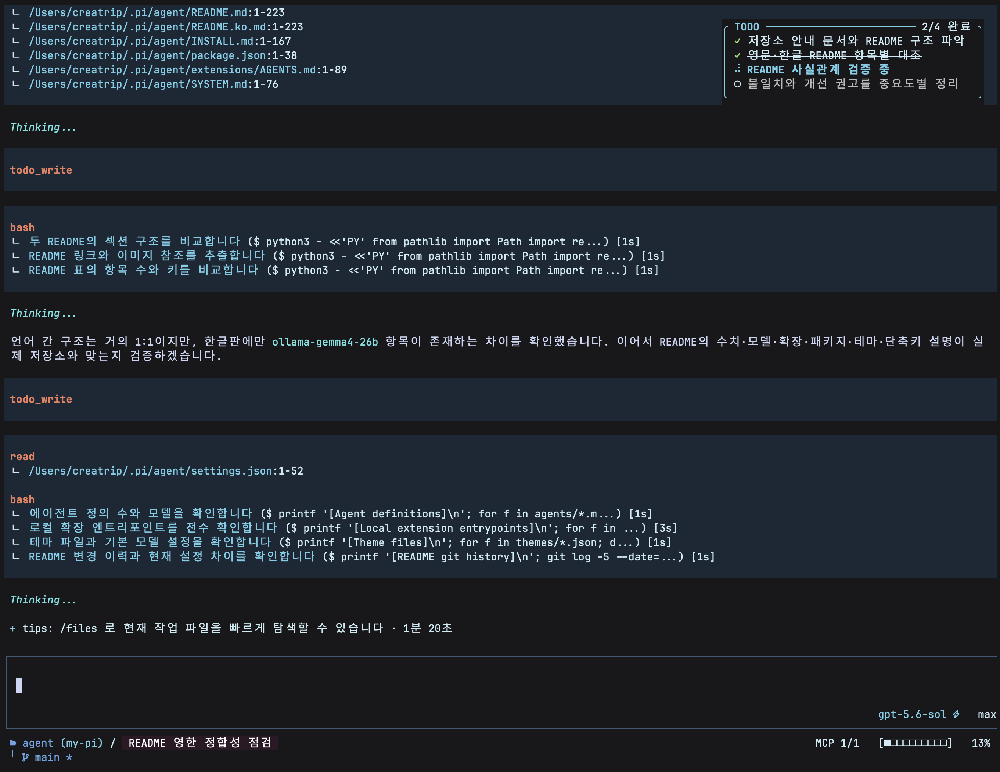
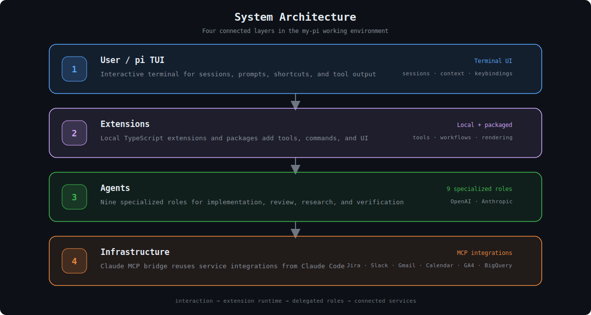

**English** | [한국어](./README.ko.md)

# my-pi

A [pi](https://github.com/mariozechner/pi-coding-agent) setup used for daily development.

This repository contains the agent definitions, local and packaged extensions, skills, and themes used together in one working environment.

> [!NOTE]
> This is a personal setup. The documentation may lag behind the current state, and some parts can change without notice.

## Usage Example

  

A typical session combines compact tool-call previews, Korean command titles, thinking/status visibility, task tracking, MCP status, model/thinking indicators, and repository context in one terminal UI.

---

## Architecture

  

The system is organized in **four layers**:

| Layer | Purpose |
|---|---|
| **User / pi TUI** | Interactive terminal interface |
| **Extensions** | Local directory-style TypeScript extensions plus installed npm extension packages |
| **Agents** | 11 specialized agent definitions with distinct roles and models |
| **Infrastructure** | MCP tool integrations via `@ryan_nookpi/pi-extension-claude-mcp-bridge` — reuses your existing Claude Code MCP setup (Jira, Slack, Gmail, Calendar, GA4, Figma, DB, etc.) |

---

## Agents

  

The current setup has 11 agent definitions, OpenAI/Anthropic agent models, and an additional Ollama Cloud provider option:

| Agent | Model | Role | When to Use |
|---|---|---|---|
| **finder** | `anthropic/claude-sonnet-4-6` | Fast file & code locator | Quick lookups, grep-like tasks |
| **worker** | `openai-codex/gpt-5.5` | General-purpose executor | Implementation, writing, fixes (complex multi-file) |
| **planner** | `anthropic/claude-opus-4-7` | Implementation architect | Breaking down complex tasks |
| **simplifier** | `anthropic/claude-sonnet-4-6` | Code simplification specialist | Clean up recently modified code, improve readability, preserve behavior |
| **code-cleaner** | `anthropic/claude-opus-4-6` | Code cleanup analyst | Find cleanup opportunities and quality issues |
| **reviewer** | `openai-codex/gpt-5.5` | Code review specialist | PR reviews, quality/correctness checks |
| **challenger** | `openai-codex/gpt-5.5` | Pressure tester | Stress-test plans before execution |
| **verifier** | `anthropic/claude-opus-4-6` | Evidence validation | Verify claims, check correctness |
| **security-auditor** | `openai-codex/gpt-5.5` | Security reviewer | Focused vulnerability reviews |
| **searcher** | `anthropic/claude-sonnet-4-6` | Research & web search | Documentation lookup, exploration |
| **browser** | `openai-codex/gpt-5.5` | Browser automation & UI testing | E2E testing, visual verification |

<strong>Model Selection</strong>

- **openai-codex/gpt-5.5** — General-purpose execution & review (implementation, testing, reviewing, security review, browser automation)
- **anthropic/claude-sonnet-4-6** — Fast exploration & research (file search, web research, code simplification)
- **anthropic/claude-opus-4-6 / 4-7** — Deep reasoning tasks (strategic planning, verification, cleanup analysis)
- **ollama-kimi-cloud/kimi-k2.6:cloud** — Enabled Ollama Cloud Kimi K2.6 provider option with text/image input support

The main agent default is `openai-codex/gpt-5.5` with high thinking.

---

## Extensions

This setup now uses a **directory-first extension layout**.

Pi can auto-discover both `extensions/*.ts` and `extensions/*/index.ts`, but this repository standardizes on **`extensions/<name>/index.ts` only** for local extensions. Root-level `*.ts` extension files are intentionally avoided to prevent duplicate loading and keep support files colocated.

- Local extensions live under `extensions/<name>/index.ts`.
- Shared helpers live under `extensions/utils/`.
- `extensions/custom-style/` is a support module used by the `footer/` facade, not a standalone auto-discovered extension.
- Installed reusable extensions are listed in `settings.json` under `packages`.
- See also [`extensions/README.md`](./extensions/README.md).

### Local extensions

#### Core / agent orchestration

| Extension | Description |
|---|---|
| [`subagent/`](./extensions/subagent/index.ts) | Multi-agent delegation engine — CLI/tool interface, session persistence, status widgets, retry/continue/batch/chain workflows, and sub-session escalation |
| [`dynamic-agents-md/`](./extensions/dynamic-agents-md/index.ts) | Dynamically injects scoped `AGENTS.md` context after exploratory/file tool results |
| [`interactive-shell/`](./extensions/interactive-shell/index.ts) | `interactive_shell` tool plus `/attach` and `/dismiss` for interactive, hands-free, dispatch, background, and reattachable shell sessions |
| [`web-access/`](./extensions/web-access/index.ts) | Local web research/content extraction tools: `web_search`, `fetch_content`, `get_search_content`, curator workflow, GitHub/PDF/video/YouTube extraction |
| [`ollama-gemma4-26b/`](./extensions/ollama-gemma4-26b/index.ts) | Ollama provider wiring for Gemma 4 26B |
| [`ollama-kimi-k2-6-cloud/`](./extensions/ollama-kimi-k2-6-cloud/index.ts) | Ollama Cloud provider wiring for Kimi K2.6 |

#### Tool overrides / rendering

| Extension | Description |
|---|---|
| [`bash-tool-override/`](./extensions/bash-tool-override/index.ts) | Overrides `bash` rendering and enforces concise Korean titles for shell commands |
| [`read-tool-override/`](./extensions/read-tool-override/index.ts) | Custom `read` tool UI/rendering |
| [`edit-tool-override/`](./extensions/edit-tool-override/index.ts) | Custom `edit` tool UI/rendering |
| [`tool-group-renderer/`](./extensions/tool-group-renderer/index.ts) | Groups/collapses related tool output for cleaner sessions |

#### UI / UX

| Extension | Description |
|---|---|
| [`footer/`](./extensions/footer/index.ts) | Custom footer facade backed by `custom-style/` state and UI modules |
| [`working-text/`](./extensions/working-text/index.ts) | Tip-focused spinner text with elapsed time during processing |
| [`theme-cycler/`](./extensions/theme-cycler/index.ts) | `Ctrl+Shift+X` / `Ctrl+Q` theme cycling plus `/theme` picker |
| [`diff-overlay/`](./extensions/diff-overlay/index.ts) | `/diff` git diff overlay with diff and commit modes |
| [`files/`](./extensions/files/index.ts) | `/files` and file-reference shortcuts for browsing, opening, revealing, and Quick Look |
| [`fork-panel/`](./extensions/fork-panel/index.ts) | `/fork-panel` to fork the current session into a Ghostty split panel |
| [`bookmark/`](./extensions/bookmark/index.ts) | `/bookmark` to save and reopen pi sessions |

#### GitHub / workflow automation

| Extension | Description |
|---|---|
| [`github-pr-merge/`](./extensions/github-pr-merge/index.ts) | `/github:pr-merge` — merge the current branch PR through `gh` |
| [`pr-comments/`](./extensions/pr-comments/index.ts) | `/github:get-pr-comments` — append unresolved inline review comments from the current PR |
| [`pr-review-re-request/`](./extensions/pr-review-re-request/index.ts) | `/github:pr-review-re-request` — re-request reviews from pending reviewers |
| [`notify/`](./extensions/notify/index.ts) | `/notify` and `/notify-off` for session completion notifications and macOS TTS |
| [`until/`](./extensions/until/index.ts) | `/until`, `/untils`, `/until-cancel`, and `until_report` for repeat-until-condition workflows |
| [`upload-image-url/`](./extensions/upload-image-url/index.ts) | `upload_image_url` — upload local/remote images to GitHub-backed storage for embedding |
| [`usage-analytics/`](./extensions/usage-analytics/index.ts) | `/analytics` — subagent and skill usage analytics overlay |
| [`archive-to-html/`](./extensions/archive-to-html/index.ts) | Archives matching temporary HTML outputs and `show_widget` renderings into `~/Documents/agent-history/분류 전` |

#### Safety

| Extension | Description |
|---|---|
| [`command-typo-assist/`](./extensions/command-typo-assist/index.ts) | Intercepts unknown slash commands, suggests the closest known command, and prefills the editor |

### Installed npm extension packages

The following reusable packages are currently listed in `settings.json`.

| Package | Role |
|---|---|
| [`@ryan_nookpi/pi-extension-codex-fast-mode`](https://github.com/Jonghakseo/pi-extension/tree/main/packages/codex-fast-mode) | Codex Fast Mode toggle |
| [`@ryan_nookpi/pi-extension-clipboard`](https://github.com/Jonghakseo/pi-extension/tree/main/packages/clipboard) | Clipboard copy tool |
| [`@ryan_nookpi/pi-extension-ask-user-question`](https://github.com/Jonghakseo/pi-extension/tree/main/packages/ask-user-question) | Interactive question form tool |
| [`@ryan_nookpi/pi-extension-auto-name`](https://github.com/Jonghakseo/pi-extension/tree/main/packages/auto-name) | Session auto-naming |
| [`@ryan_nookpi/pi-extension-delayed-action`](https://github.com/Jonghakseo/pi-extension/tree/main/packages/delayed-action) | Delayed follow-up actions |
| [`@ryan_nookpi/pi-extension-idle-screensaver`](https://github.com/Jonghakseo/pi-extension/tree/main/packages/idle-screensaver) | Idle screensaver |
| [`@ryan_nookpi/pi-extension-todo-write-overlay`](https://github.com/Jonghakseo/pi-extension/tree/main/packages/todo-write-overlay) | `todo_write` task tracking tool with the overlay UI; replaces the legacy `todo-write` package |
| [`@ryan_nookpi/pi-extension-open-pr`](https://github.com/Jonghakseo/pi-extension/tree/main/packages/open-pr) | Open the current branch PR |
| [`@ryan_nookpi/pi-extension-generative-ui`](https://github.com/Jonghakseo/pi-extension/tree/main/packages/generative-ui) | `visualize_read_me`, `show_widget` native visual widgets |
| [`@ryan_nookpi/pi-extension-cross-agent`](https://github.com/Jonghakseo/pi-extension/tree/main/packages/cross-agent) | Load agent definitions/commands from `.claude`, `.gemini`, `.codex` |
| [`@ryan_nookpi/pi-extension-claude-hooks-bridge`](https://github.com/Jonghakseo/pi-extension/tree/main/packages/claude-hooks-bridge) | Claude Code hooks bridge |
| [`@ryan_nookpi/pi-extension-claude-mcp-bridge`](https://github.com/Jonghakseo/pi-extension/tree/main/packages/claude-mcp-bridge) | Claude Code MCP bridge |
| [`@ryan_nookpi/pi-extension-memory-layer`](https://github.com/Jonghakseo/pi-extension/tree/main/packages/memory-layer) | Persistent memory tools |
| [`@ryan_nookpi/pi-extension-diff-review`](https://github.com/Jonghakseo/pi-extension/tree/main/packages/diff-review) | Diff review assistance |
| [`@ryan_nookpi/pi-extension-claude-spinner`](https://github.com/Jonghakseo/pi-extension/tree/main/packages/claude-spinner) | Claude-style spinner/status feedback |
| [`@ryan_nookpi/pi-extension-cc-system-prompt`](https://github.com/Jonghakseo/pi-extension/tree/main/packages/cc-system-prompt) | Claude Code style system prompt |
| [`@ryan_nookpi/pi-extension-codex-large-context`](https://github.com/Jonghakseo/pi-extension/tree/main/packages/codex-large-context) | Codex large-context support |

---

## Themes

The setup currently ships with 8 themes, hot-swappable with `Ctrl+Shift+X` / `Ctrl+Q` or selectable with `/theme`:

| Theme | Style |
|---|---|
| **zentui** *(default)* | Minimal ZenTUI-inspired dark theme |
| **nord** | Arctic, clean blues and frost tones |
| **catppuccin-mocha** | Warm pastels on dark chocolate |
| **darcula** | Deep JetBrains-style dark tones |
| **dracula** | Higher-contrast purple-toned dark theme |
| **gruvbox** | Retro warm tones, easy on the eyes |
| **midnight-ocean** | Deep sea blues and teals |
| **rose-pine** | Muted, elegant rose tones |

---

## Keybindings

| Key | Action |
|---|---|
| `Ctrl+T` | Toggle thinking visibility |
| `Ctrl+Shift+X` | Cycle themes forward |
| `Ctrl+Q` | Cycle themes backward |
| `Ctrl+Shift+O` | Open file browser |
| `Ctrl+Shift+F` | Reveal the latest file reference in Finder |
| `Ctrl+Shift+R` | Quick Look the latest file reference |
| `Ctrl+O` | Toggle tool output collapse/expand (pi built-in, customized by local tool renderers) |

---

## Web Research Extension

This setup maintains the web research stack as a local extension in [`extensions/web-access/`](./extensions/web-access/index.ts).

- Tools: `web_search`, `fetch_content`, `get_search_content`
- Providers/workflows: Exa, Perplexity, Gemini API, Gemini Web, URL context, curator summary review
- Extractors: readable web pages, GitHub repositories/files, PDFs, RSC payloads, YouTube/video frames and transcripts

---

## Notes

A few practical choices shape this setup:

**1. Roles are separated by task.**
Each agent has a narrow responsibility so delegation stays predictable.

**2. Extensions are split by lifecycle.**
Reusable pieces graduate into npm packages; local experiments and personal workflow glue stay in `extensions/<name>/index.ts`.

**3. Safety features stay enabled.**
Typo checks, confirmations, scoped AGENTS.md injection, and visibility controls are part of the default workflow.

**4. Most workflows stay in the terminal.**
File browsing, diffs, PR work, web research, shells, notifications, and automation are handled from the same environment.
